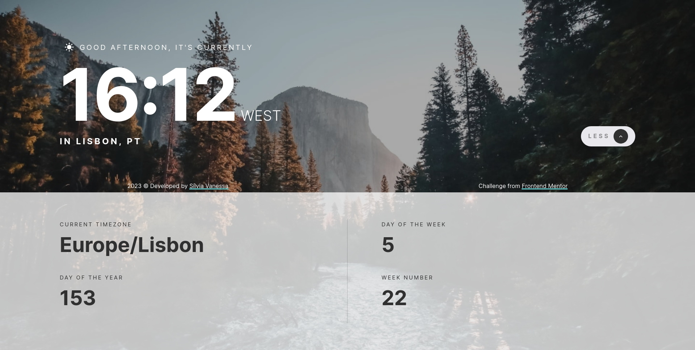
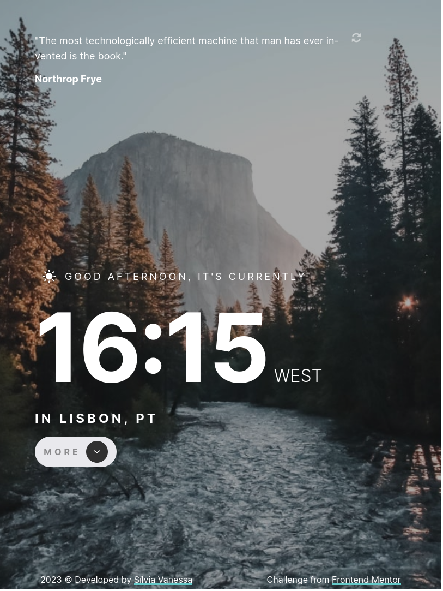
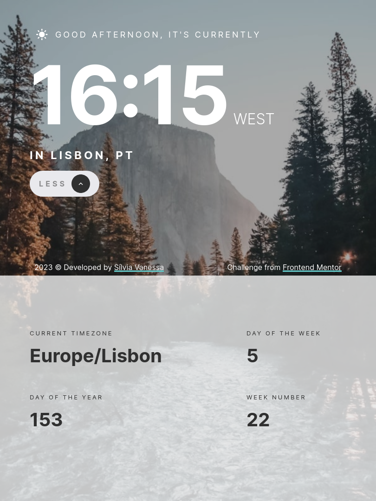
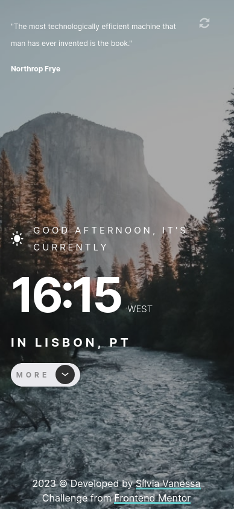
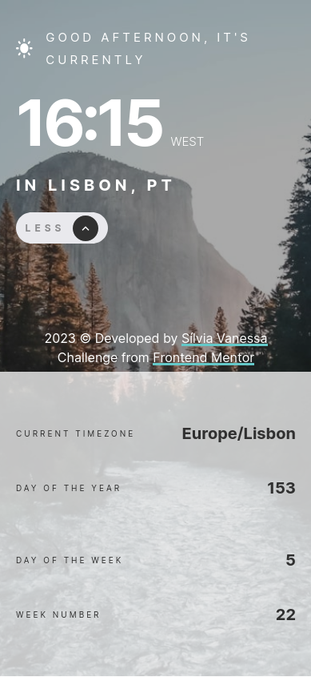

# Frontend Mentor - Clock app solution

This is a solution to the [Clock app challenge on Frontend Mentor](https://www.frontendmentor.io/challenges/clock-app-LMFaxFwrM). Frontend Mentor challenges help you improve your coding skills by building realistic projects. 

## Table of contents

- [Overview](#overview)
  - [The challenge](#the-challenge)
  - [Screenshot](#screenshot)
  - [Links](#links)
- [My process](#my-process)
  - [Built with](#built-with)
  - [What I learned](#what-i-learned)
  - [Continued development](#continued-development)
- [Author](#author)

## Overview

### The challenge

Users should be able to:

- View the optimal layout for the site depending on their device's screen size
- See hover states for all interactive elements on the page
- View the current time and location information based on their IP address
- View additional information about the date and time in the expanded state
- Be shown the correct greeting and background image based on the time of day they're visiting the site
- Generate random programming quotes by clicking the refresh icon near the quote

### Screenshot

#### Web

#### Tablet

#### Mobile

### Links

- Solution URL: [Solution here](https://www.frontendmentor.io/solutions/clock-app-vite-and-vanilla-js-92_WDHbew1)
- Live Site URL: [Demo here](https://dashboard-nessvah.netlify.app/)

## My process

### Built with

- Semantic HTML5 markup (JS generated)
- CSS custom properties and media queries
- Flexbox
- Web-first workflow
- Vanilla JavaScript 
- Vite 

### What I learned

This challenge helped me understand better how to work with fetching data from REST APIs but also allowed me to start
learning about asynchronous programming and using the async await keyword instead of the fetch then.

### Continued development

My goal is to improve my asynchronous programming skills and start to apply some error handling, especially in these cases
where we are dealing heavily with external information and servers.

This project might be refactored in the future to be a Chrome extension.

## Author

- Frontend Mentor - [@Nessvah](https://www.frontendmentor.io/profile/Nessvah)
- Twitter - [@Nessvah_](https://www.twitter.com/Nessvah_)
- Linkedin- [@Nessvah](https://www.linkedin.com/in/nessvah)

